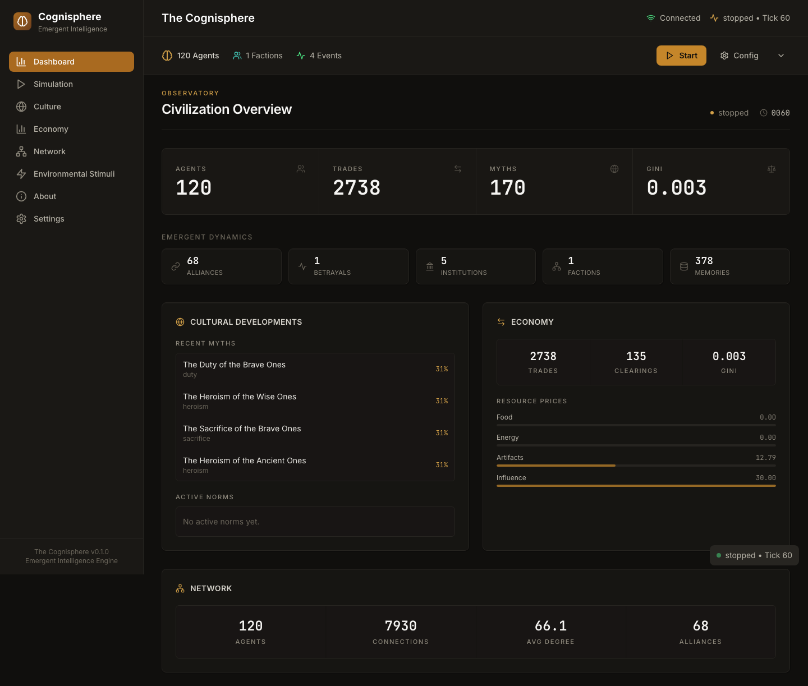

# The Cognisphere: Emergent Intelligence Civilization Engine

[](https://github.com/zaydabash/the-cognisphere/actions/workflows/ci.yml)
[](https://github.com/zaydabash/the-cognisphere/actions/workflows/release.yml)
[](https://github.com/zaydabash/the-cognisphere/deployments/activity_log?environment=github-pages)
[](https://dashboard.render.com/)

A living ecosystem of cognitive agents that evolve language, culture, alliances, and institutions through emergent dynamics.

## Architecture Overview

```
Frontend (React + Vite)
    React dashboard, live visualization, control panel
        |
        v
Backend (FastAPI)
    Simulation engine, scheduler, REST API
        |
        v
Agent system
    Cognitive agents, memory layer, cultural evolution, economy
        |
        v
Storage
    NetworkX or Neo4j graph, FAISS vectors, event history
```

The frontend talks to the FastAPI backend over REST. The backend drives the
simulation engine, which steps the agent system every tick. Agent memory is
held in an in process graph plus a vector store, with optional write through to
Neo4j. Environmental stimuli (optional) feed real world signals into the
simulation.

## Live Dashboard

The dashboard shows real time metrics and a civilization overview.



## Key Features

### Environmental Stimuli Integration (opt in)

- **Real world data**: RSS feeds from BBC technology, science, and business sources.
- **Cultural mirroring**: agents reflect real world events in their culture.
- **Divergence evolution**: cultural drift creates a unique "future version" of the civilization.
- **Sentiment analysis**: emotional impact processing of environmental events.

> Environmental stimuli pull live network data and are therefore
> nondeterministic. They are disabled by default so seeded runs stay
> reproducible. Enable them per simulation with `enable_environmental_stimuli=true`
> in the config, or the matching field on the `/simulation/initialize` request.

### Multi Agent Intelligence

- **Cognitive architecture**: each agent has a unique personality (OCEAN model).
- **Memory systems**: graph based relationships plus vector based semantic memory.
- **Learning and adaptation**: agents adapt through evolving trust relationships and
  experience driven reflection (satisfaction tracks the emotional valence of
  recalled memories), so behaviour shifts with accumulated experience.
- **Social dynamics**: trust, betrayal, alliance formation, and faction creation.

### Live Visualization

- **Network graphs**: interactive agent relationship visualization.
- **Cultural timeline**: myth creation and norm evolution tracking.
- **Economic charts**: trade activity, resource distribution, wealth inequality.
- **Language drift**: slang evolution and communication pattern analysis.

## About The Cognisphere

The Cognisphere is an experimental simulation platform that explores emergent
intelligence through multiagent systems. It creates a digital civilization where
hundreds of cognitive agents (presets scale up to about 1,000) interact, learn,
and evolve complex social structures without predetermined scripts.

### What Makes It Different

**Emergent intelligence**: unlike traditional simulations with hardcoded
behaviour, Cognisphere agents develop their own strategies, relationships, and
cultural norms through interaction and experience.

**Cultural evolution**: agents create myths, develop slang, establish social
norms, and form institutions that persist and evolve over time. Language itself
drifts and mutates as agents communicate.

**Economic dynamics**: an economy emerges from agent interactions, including
trade negotiations, resource management, market dynamics, and wealth
distribution patterns.

**Social complexity**: agents form alliances, betray each other, create
factions, and build institutions. Trust relationships evolve based on past
interactions and reputation.

**Live visualization**: watch the civilization unfold through interactive
network graphs, cultural timelines, economic indicators, and agent behaviour.

### Core Concepts

**Agent personality**: each agent has a unique personality profile (based on
OCEAN traits) that influences behaviour, decision making, and social interaction.

**Memory systems**: agents maintain episodic memory (events), semantic memory
(concepts), and social memory (relationships) using graph and vector stores.

**Cultural transmission**: ideas, myths, and norms spread through the population
via social networks, creating cultural evolution patterns.

**Economic emergence**: trade relationships, resource scarcity, and market
dynamics emerge naturally from agent needs and interactions.

**Institutional formation**: agents can create lasting institutions such as
councils, temples, and governance systems that persist beyond individual agents.

### Applications

**Research**: study emergent behaviour, cultural evolution, economic dynamics,
and social network formation.

**Education**: understand complex systems, agent based modeling, and emergent
intelligence concepts.

**Entertainment**: watch civilizations develop, collapse, and evolve in
unexpected ways.

**AI development**: explore how simple rules can lead to complex, intelligent
seeming behaviour.

### Technical Stack

- **Graph store**: NetworkX in process, with optional write through to Neo4j.
- **Vector store**: FAISS for semantic memory.
- **Visualization**: interactive network graphs in the React dashboard.
- **Scale**: hundreds of agents (up to about 1,000) on a laptop.
- **Reproducibility**: deterministic seeded runs.
- **Live dashboard** for real time monitoring.

## Overview

The Cognisphere simulates a digital civilization with hundreds of lightweight
cognitive agents who:

- Evolve language, culture, alliances, norms, and mythology.
- Maintain collective memory across many ticks.
- Negotiate, trade, betray, form factions, and build institutions.
- React to real world environmental stimuli (when enabled).
- Produce emergent structure without hardcoded scripts.

## Quick Start

### Backend

```bash
cd backend
pip install -r requirements.txt
python -m uvicorn app:app --host 127.0.0.1 --port 8000
```

### Frontend

```bash
cd frontend
npm install
npm run dev
```

Then open the dashboard at the URL Vite prints (the app is served under the
`/the-cognisphere/` base path).

### Run a simulation from the command line

```bash
python scripts/seed_and_run.py --preset lab --ticks 300 --seed 42
```

### Docker

```bash
docker-compose -f docker/docker-compose.yml up --build -d
```

## Core Features

### Agent cognitive architecture

- Personality vectors (OCEAN style).
- Trust calculus and relationship weights.
- Ideology vectors for soft alignment.
- Language lexicons with drifting slang.
- Episodic, semantic, and social memory.
- Retrieval augmented creation: agents recall recent episodic memories to shape
  the myths and slang they generate, and reflect on memory valence to adapt.

### Economy and social dynamics

- Resource based economy (food, energy, artifacts, influence).
- Bilateral negotiation with alternating offers.
- Market fallback with double auction clearing.
- Alliance and betrayal mechanics with reputation tracking.
- Faction dynamics and institution formation.

### Cultural evolution

- Language drift with slang mutation and Jensen Shannon divergence tracking.
- Myth generation and canonization.
- Norm voting systems with soft penalties.
- Cultural diffusion via probabilistic slang adoption (contagion style spread).

### Memory layer

- In memory NetworkX knowledge graph by default. Optional Neo4j write through
  (`memory_backend=neo4j`) persists every memory node and edge to a Neo4j
  database, and falls back to NetworkX automatically if no server is reachable.
- FAISS vector store for semantic retrieval.
- Snapshot and rewind capability for time travel.
- Deterministic seeded runs (`PYTHONHASHSEED=0` is pinned by the CLI runner).

## Testing

The Cognisphere ships a 94 test pytest suite (unit plus integration) covering
the agent, culture, economy, social, negotiation, memory, engine, and auth
subsystems. Line coverage of the simulation and adapter code is currently about
62 percent, with an enforced floor of 60 percent in `pytest.ini`.

```bash
cd backend
python -m pytest
```

The social engine, negotiation engine with double auction fallback, and the
hybrid memory manager are wired into the tick loop and run on every simulation.
Their activity (alliances, betrayals, institutions, reputation, negotiations,
market clearings, world memories) is surfaced in `world.stats` and the
`/simulation/status` response.

## Code Quality

```bash
cd backend
black --line-length=100 .
isort --profile=black .
flake8 .
mypy .
```

- **Black**: code is formatted clean.
- **isort**: imports sorted with the black profile.
- **Flake8**: style and complexity checks pass clean.
- **MyPy**: static type checking passes with zero errors across the source files.
- **Pytest**: 94 test suite with a coverage gate (floor 60 percent, currently about 62 percent).
- **Pre commit**: hooks configured in `.pre-commit-config.yaml` (black, isort, flake8, hygiene).

Continuous integration runs all of the above on every push and pull request,
plus a frontend type check, lint, and build.

## Configuration

These are simulation parameters, set on the `SimulationConfig` object or via the
`/simulation/initialize` API request. They are not environment variables.

| Parameter | Default | Description |
|-----------|---------|-------------|
| `num_agents` | 300 | Number of agents in the simulation |
| `seed` | 42 | Random seed for reproducibility |
| `tick_duration_ms` | 100 | Milliseconds per simulation tick |
| `llm_mode` | mock | LLM mode: `mock` or `openai` |
| `memory_backend` | networkx | Memory backend: `networkx` or `neo4j` |
| `vector_backend` | faiss | Vector backend: `faiss` or `chroma` |
| `enable_environmental_stimuli` | false | Pull live RSS stimuli (nondeterministic) |

> Reproducibility note: the CLI runner (`scripts/seed_and_run.py`) pins
> `PYTHONHASHSEED=0` so that seeded runs are bit for bit reproducible. Set the
> same environment variable when running the engine elsewhere if you need
> identical results across processes.

## Production Deployment

### Backend (Render)

- Set `ENVIRONMENT=production`.
- Set `CORS_ORIGINS` to your frontend origin (for example `https://zaydabash.github.io`).
- Optionally enable authentication with `API_KEY` and `REQUIRE_AUTH=true`.

The repository includes `render.yaml` (a Render blueprint) and a backend
Dockerfile that binds the platform provided `$PORT`.

### Frontend (GitHub Pages)

- The build bakes in `VITE_API_URL` (the deployed backend URL) so the static
  site calls the backend instead of a relative path.
- The `deploy-frontend.yml` workflow publishes the dashboard to GitHub Pages.

See PRODUCTION_SETUP.md for detailed instructions.

### Environment variables

Backend:

- `ENVIRONMENT`: set to `production` to enable production mode.
- `CORS_ORIGINS`: comma separated list of allowed origins.
- `API_KEY`: API key for authentication (optional).
- `REQUIRE_AUTH`: enable or disable authentication.

Frontend:

- `VITE_API_URL`: backend API URL, baked into the build.

## Security

### Input validation

- Pydantic models validate all API inputs with type checking and constraints.
- Snapshot and file paths are validated to prevent directory traversal.
- Simulation actions are validated against a whitelist.
- Numeric inputs are validated with minimum and maximum constraints.

### CORS

- Origins are restricted in production and open in development.
- Set the `CORS_ORIGINS` environment variable for production.
- Only specific HTTP methods are allowed (GET, POST, PUT, DELETE, OPTIONS).

### Error handling

- Error messages do not leak internal details in production.
- Appropriate HTTP status codes are used (400, 401, 403, 404, 500).
- A global exception handler prevents information disclosure.

### Secrets

- No hardcoded secrets. Sensitive data lives in environment variables.
- Example env files are provided without real secrets.
- All `.env` files and secret directories are excluded from version control.

### Reporting security issues

1. Report privately via the repository Security tab, using "Report a
   vulnerability" (GitHub private vulnerability reporting).
2. Do not open a public issue for security problems.
3. Include a description, steps to reproduce, and potential impact.

See SECURITY.md for full details.

## Project Structure

```
cognisphere/
  backend/     FastAPI simulation engine
  frontend/    React dashboard
  docker/      Containerization
  scripts/     Utilities and seeding
  data/        Sample stimuli and configs
  README.md    This file
```

## Deployment Status

- Configuration files are ready (`render.yaml`, deployment workflows).
- The Render service still needs to be created and connected.
- GitHub repository variables and secrets still need to be configured.

To connect the backend, follow RENDER_SETUP_CHECKLIST.md.

## License

MIT License. See the LICENSE file for details.
