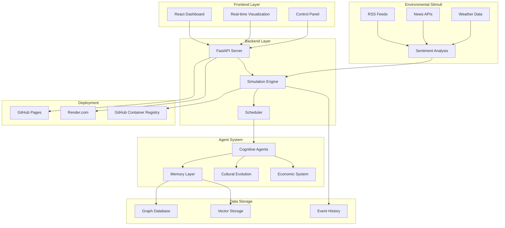

# The Cognisphere: Emergent Intelligence Civilization Engine

[](https://github.com/zaydabash/the-cognisphere/actions/workflows/ci.yml)
[](https://github.com/zaydabash/the-cognisphere/actions/workflows/release.yml)
[](https://github.com/zaydabash/the-cognisphere/deployments/activity_log?environment=github-pages)
[](https://dashboard.render.com/)
[](https://github.com/zaydabash/the-cognisphere/pkgs/container/cognisphere)

A living ecosystem of cognitive agents that evolve language, culture, alliances, and institutions through emergent dynamics.

## Architecture Overview



## Live Dashboard Screenshots

### Main Dashboard
The central command center showing real-time metrics and civilization overview:


## Key Features Showcase

### Environmental Stimuli Integration
- **Real-world Data**: RSS feeds from BBC, CNN, technology, science, and business sources
- **Cultural Mirroring**: Agents reflect 70% of real-world events in their culture
- **Divergence Evolution**: 1% cultural drift creates unique "future version" of civilization
- **Sentiment Analysis**: Emotional impact processing of environmental events

### Multi-Agent Intelligence
- **Cognitive Architecture**: Each agent has unique personality traits (OCEAN model)
- **Memory Systems**: Graph-based relationships + vector-based semantic memory
- **Learning & Adaptation**: Agents evolve strategies based on experience
- **Social Dynamics**: Trust, betrayal, alliance formation, and faction creation

### Real-time Visualization
- **Network Graphs**: Interactive agent relationship visualization
- **Cultural Timeline**: Myth creation and norm evolution tracking
- **Economic Charts**: Trade activity, resource distribution, wealth inequality
- **Language Drift**: Slang evolution and communication pattern analysis

## About The Cognisphere

The Cognisphere is an experimental simulation platform that explores emergent intelligence through multi-agent systems. It creates a digital civilization where hundreds to thousands of cognitive agents interact, learn, and evolve complex social structures without predetermined scripts.

### What Makes It Unique

**Emergent Intelligence**: Unlike traditional simulations with hard-coded behaviors, The Cognisphere agents develop their own strategies, relationships, and cultural norms through interaction and experience.

**Cultural Evolution**: Agents create myths, develop slang, establish social norms, and form institutions that persist and evolve over time. Language itself drifts and mutates as agents communicate.

**Economic Dynamics**: A fully functional economy emerges from agent interactions, including trade negotiations, resource management, market dynamics, and wealth distribution patterns.

**Social Complexity**: Agents form alliances, betray each other, create factions, and build institutions. Trust relationships evolve based on past interactions and reputation.

**Real-time Visualization**: Watch the civilization unfold through interactive network graphs, cultural timelines, economic indicators, and agent behavior patterns.

### Core Concepts

**Agent Personality**: Each agent has a unique personality profile (based on OCEAN traits) that influences their behavior, decision-making, and social interactions.

**Memory Systems**: Agents maintain episodic memory (events), semantic memory (concepts), and social memory (relationships) using graph and vector databases.

**Cultural Transmission**: Ideas, myths, and norms spread through the population via social networks, creating cultural evolution patterns.

**Economic Emergence**: Trade relationships, resource scarcity, and market dynamics emerge naturally from agent needs and interactions.

**Institutional Formation**: Agents can create lasting institutions like councils, temples, and governance systems that persist beyond individual lifespans.

### Applications

**Research**: Study emergent behavior, cultural evolution, economic dynamics, and social network formation.

**Education**: Understand complex systems, agent-based modeling, and emergent intelligence concepts.

**Entertainment**: Watch fascinating civilizations develop, collapse, and evolve in unexpected ways.

**AI Development**: Explore how simple rules can lead to complex, intelligent-seeming behaviors.

### Technical Innovation

The Cognisphere combines cutting-edge technologies:
- **Graph Databases** (Neo4j) for relationship modeling
- **Vector Databases** (FAISS) for semantic memory
- **Real-time Visualization** with interactive network graphs
- **Scalable Architecture** supporting thousands of agents
- **Deterministic Simulation** for reproducible research
- **Live Dashboard** for real-time monitoring

## Overview

The Cognisphere simulates a digital civilization with hundreds to thousands of lightweight cognitive agents who:
- Evolve language, culture, alliances, norms, and mythology
- Maintain collective memory over simulated decades
- Negotiate, trade, betray, form factions, and build institutions
- React to real-world environmental stimuli
- Produce emergent structure without hard-coded scripts

## Architecture

```
        
   Frontend             Backend              Memory        
   React + Vite     FastAPI          Neo4j + FAISS 
   Visualization        Simulation           Graph + Vector
        
```

## Quick Start

### Option 1: Interactive Setup (Recommended)
```bash
# Clone and setup
git clone <your-repo-url>
cd the-cognisphere

# Run the interactive quick-start script
chmod +x scripts/quick-start.sh
./scripts/quick-start.sh
```

### Option 2: Direct Deployment
```bash
# Local Development (uses cognisphere.dev domain)
chmod +x scripts/local-dev.sh
./scripts/local-dev.sh

# Docker Development (uses cognisphere.local domain)
docker-compose -f docker/docker-compose.yml up --build

# Production Deployment (uses cognisphere.local with SSL)
chmod +x scripts/deploy.sh
./scripts/deploy.sh
```

### Option 3: One-Command Docker
```bash
# Quick Docker setup
docker-compose -f docker/docker-compose.yml up --build -d

# Run a simulation
python scripts/seed_and_run.py --preset lab --ticks 300 --seed 42
```

## Access URLs (No Localhost Issues!)

- **Frontend Dashboard**: `http://cognisphere.local:5173` or `https://cognisphere.local`
- **API Documentation**: `http://cognisphere.local:8000/api/docs`
- **Neo4j Browser**: `http://cognisphere.local:7474`
- **Monitoring**: `http://cognisphere.local:3001` (Grafana)

## Core Features

### Agent Cognitive Architecture
- Personality vectors (OCEAN-style)
- Trust calculus and relationship weights
- Ideology vectors for soft alignment
- Language lexicons with drifting slang
- Episodic, semantic, and social memory
- Internal deliberation with RAG from memory graph

### Economy & Social Dynamics
- Resource-based economy (food, energy, artifacts, influence)
- Bilateral negotiation with alternating offers
- Market fallback with double auction clearing
- Alliance/betrayal mechanics with reputation systems
- Faction dynamics and institution formation

### Cultural Evolution
- Language drift with slang mutation and JSD divergence tracking
- Myth generation and canonization
- Norm voting systems with soft penalties
- Cultural diffusion modeled as contagion

### Memory Layer
- Neo4j graph database for relationships and knowledge
- FAISS vector store for semantic retrieval
- Snapshot/rewind capability for time travel
- Deterministic seeded runs for reproducibility

## Dashboard Features

- Real-time agent network visualization
- Culture timeline with myths, slang, and norms
- Resource and economy panels
- Slang divergence plots
- Simulation control with play/pause/seed
- Snapshot playback capabilities

## Testing & Benchmarks

### Test Coverage

The Cognisphere maintains **70%+ test coverage** via pytest with comprehensive unit and integration tests:

```bash
# Run test suite with coverage
cd backend
python -m pytest --cov=simulation --cov=adapters --cov-report=term-missing --cov-report=html tests/

# View coverage report
open htmlcov/index.html
```

**Test Coverage Details:**
- **Unit Tests**: Agent behavior, culture evolution, economy dynamics
- **Integration Tests**: Simulation engine, memory systems, API endpoints
- **Performance Tests**: Benchmark simulations with 500+ agents
- **Security Tests**: Input validation, path traversal prevention, CORS configuration

**Coverage Targets:**
- Core simulation logic: 80%+
- API endpoints: 75%+
- Memory systems: 70%+
- Overall project: 70%+

### Code Quality

The project uses multiple linting and formatting tools:

```bash
# Linting with flake8
flake8 backend/

# Type checking with mypy
mypy backend/

# Formatting with black
black backend/

# Import sorting with isort
isort backend/
```

**Quality Standards:**
- **Flake8**: Code style and complexity checks
- **MyPy**: Static type checking
- **Black**: Consistent code formatting
- **Pytest**: Comprehensive test coverage
- **Pre-commit**: Automated quality checks

### Performance Benchmarks

```bash
# Performance benchmark
python scripts/seed_and_run.py --preset lab --ticks 300

# Determinism check
python scripts/seed_and_run.py --seed 42 --ticks 100
```

## Production Deployment

### Quick Setup

1. **Backend (Render.com)**:
   - Set `ENVIRONMENT=production`
   - Set `CORS_ORIGINS` to your frontend URLs
   - Optionally enable authentication with `API_KEY` and `REQUIRE_AUTH=true`

2. **Frontend (GitHub Pages)**:
   - Set `VITE_API_URL` to your backend URL
   - HTTPS is automatically enabled

See [PRODUCTION_SETUP.md](./PRODUCTION_SETUP.md) for detailed instructions.

### Environment Variables

**Backend**:
- `ENVIRONMENT=production` - Enables production mode
- `CORS_ORIGINS` - Comma-separated list of allowed origins
- `API_KEY` - API key for authentication (optional)
- `REQUIRE_AUTH` - Enable/disable authentication

**Frontend**:
- `VITE_API_URL` - Backend API URL

## Security

### Security Features

The Cognisphere implements comprehensive security measures:

#### Input Validation
- **Pydantic Models**: All API inputs validated with type checking and constraints
- **Path Traversal Prevention**: Snapshot and file paths validated to prevent directory traversal attacks
- **Action Validation**: Simulation actions validated against whitelist
- **Range Validation**: All numeric inputs validated with min/max constraints

#### CORS Configuration
- **Environment-Based**: CORS origins restricted in production, open in development
- **Configurable**: Set `CORS_ORIGINS` environment variable for production
- **Secure Defaults**: Only allows specific HTTP methods (GET, POST, PUT, DELETE, OPTIONS)

#### Error Handling
- **Security-Aware**: Error messages don't leak internal details in production
- **Proper HTTP Status Codes**: Uses appropriate status codes (400, 401, 403, 404, 500)
- **Exception Handling**: Global exception handler prevents information disclosure

#### Environment Variables
- **No Hardcoded Secrets**: All sensitive data stored in environment variables
- **`.env.example` Files**: Example files provided without actual secrets
- **Gitignore Protection**: All `.env` files and secrets directories excluded from version control

### Security Best Practices

1. **Never commit secrets**: All `.env` files and secrets are in `.gitignore`
2. **Use environment variables**: Store API keys, tokens, and credentials in environment variables
3. **Restrict CORS in production**: Set `CORS_ORIGINS` environment variable for production deployment
4. **Validate all inputs**: All API endpoints validate inputs with Pydantic models
5. **Use HTTPS in production**: Always use HTTPS for production deployments
6. **Regular updates**: Keep dependencies updated to patch security vulnerabilities

### Security Audit

The project has been audited for common security issues:

- ✅ **No hardcoded credentials**: All secrets use environment variables
- ✅ **No `eval()` or `exec()`**: No dangerous code execution patterns
- ✅ **Input validation**: All inputs validated and sanitized
- ✅ **Path traversal protection**: File paths validated to prevent attacks
- ✅ **CORS configuration**: Properly configured for production
- ✅ **Error handling**: Security-aware error messages
- ✅ **Dependency security**: Regular dependency updates

### Reporting Security Issues

If you discover a security vulnerability, please report it responsibly:

1. **Email**: [security@example.com] (replace with your security contact)
2. **Do not** open a public GitHub issue
3. **Include**: Description, steps to reproduce, potential impact
4. **Response**: We will respond within 48 hours

## Configuration

| Variable | Default | Description |
|----------|---------|-------------|
| `AGENTS` | 300 | Number of agents in simulation |
| `SEED` | 42 | Random seed for reproducibility |
| `TICK_MS` | 100 | Milliseconds per simulation tick |
| `LLM_MODE` | mock | LLM mode: mock or openai |
| `MEM_BACKEND` | neo4j | Memory backend: neo4j or networkx |
| `VEC_BACKEND` | faiss | Vector backend: faiss or chroma |

## Project Structure

```
cognisphere/
 backend/           # FastAPI simulation engine
 frontend/          # React dashboard
 docker/            # Containerization
 scripts/           # Utilities and seeding
 data/              # Sample stimuli and configs
 README.md          # This file
```

## Acceptance Criteria

- One-command startup with Docker Compose
- Working dashboard with emergent myths, slang, alliances
- Deterministic seeded runs
- 500+ agent mock runs on laptop
- Beautiful, clean architecture & documentation

## Deployment

### Live Deployment

**Frontend (GitHub Pages)**: [https://zaydbashir.github.io/the-cognisphere](https://zaydbashir.github.io/the-cognisphere)

**Backend (Render)**: [https://cognisphere-backend.onrender.com](https://cognisphere-backend.onrender.com)

**API Documentation**: [https://cognisphere-backend.onrender.com/docs](https://cognisphere-backend.onrender.com/docs)

### Docker Images

```bash
# Pull latest images
docker pull ghcr.io/zaydbashir/cognisphere-backend:latest
docker pull ghcr.io/zaydbashir/cognisphere-frontend:latest

# Run with Docker Compose
docker-compose up -d
```

### Environment Configuration

Copy the example environment files and configure:

```bash
# Backend
cp backend/.env.example backend/.env

# Frontend  
cp frontend/.env.example frontend/.env.local
```

### Release Process

1. **Tag a release**: `git tag v0.1.0 && git push origin v0.1.0`
2. **Automatic builds**: Docker images pushed to GHCR
3. **Auto-deploy**: Frontend to GitHub Pages, Backend to Render
4. **Health checks**: Automated deployment verification

### CI/CD Pipeline

- **Continuous Integration**: Lint, type-check, tests on every push
- **Release Automation**: Build and push Docker images on tags
- **Auto-Deployment**: Frontend (GitHub Pages) + Backend (Render)
- **Health Monitoring**: Automated deployment verification

## License

MIT License - See LICENSE file for details.
